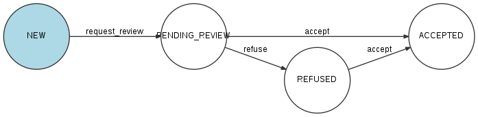

.. _feedbacks:

Observations
============

Une observation est constituée d'une description, d'une position géographique, et optionnellement d'une ou plusieurs photos. Tous les utilisateurs peuvent créer des observations.

Le plus souvent, l'utilisateur va aussi attacher son observation à une catégorie donnée. Par conséquent, cette observation sera également rattachée à l'organisation à laquelle appartient cette catégorie.

.. _feedbacks-creation:

Création d'une observation
--------------------------

.. code-block::

    POST /feedbacks/issues

Exemple :

.. code-block:: json

    {
        "geo":
            {
                "elevation":1,
                "point":
                    {
                        "latitude":44.851343361295214,
                        "longitude":-0.5763262510299683
                    }
            },
        "category":"b0d007d5-e6ad-4113-b2b5-d8a1858a2fb1",
        "description":"Mon feedback 5",
        "reporter":"6dbbd601-267f-46ea-be90-8c9742f7180b",
        "image":"data:image/png;base64,iVBORw0KGgoAAAANSUhEUgAAAAEAAAABCAYAAAAfFcSJAAAADUlEQVR42mP8/5+hHgAHggJ/PchI7wAAAABJRU5ErkJggg=="
    }

Ce endpoint se présente sous la forme **/feedbacks/issue** et non pas simplement **/feedbacks**, car à terme, il sera possible de créer différents types d'observation. Actuellement, seul le type "issue" est disponible.

Coordonnées géographiques du point : LIEN

Image : LIEN

L'utilisateur peut ensuite ajouter d'autres images à son observation :

.. code-block::

    POST /feedbacks/{feedback}/images

Exemple :

.. code-block:: json

    {
        "image":"data:image/png;base64,iVBORw0KGgoAAAANSUhEUgAAAAUAAAAFCAIAAAACDbGyAAAACXBIWXMAAAsTAAALEwEAmpwYAAAAB3RJTUUH4QIVDRUfvq7u+AAAABl0RVh0Q29tbWVudABDcmVhdGVkIHdpdGggR0lNUFeBDhcAAAAUSURBVAjXY3wrIcGABJgYUAGpfABZiwEnbOeFrwAAAABJRU5ErkJggg=="
    }

.. _feedbacks-lifecyle:

Modération et cycle de vie d'une observation
--------------------------------------------

Après qu'un utilisateur a créé une nouvelle observation, celle-ci possède le statut PENDING_REVIEW : en attente de modération. Elle devra être validée par un administrateur de l'application.

LIEN : statuts et changements de statuts

Un administrateur d'application valide une observation avec le endpoint :

.. code-block::

    POST /feedbacks/{feedback}/state

Exemple :

.. code-block:: json

    [
        {
            "op":"replace",
            "path":"transition",
            "value":"accept"
        }
    ]

L'observation prend alors le statut ACCEPTED et un rapport est créé sur cette observation.

LIEN : rapports

Pour refuser une observation :

.. code-block::

    [
        {
            "op":"replace",
            "path":"transition",
            "value":"refuse"
        }
    ]

L'observation prend alors le statut REFUSED.

**Acceptation automatique d'une observation**

Un utilisateur qui est membre d'une organisation peut créer une nouvelle observation qui sera automatiquement acceptée sans passer par l'étape de modération. À condition que cette nouvelle observation soit effectuée sur une catégorie appartenant à l'organisation dont l'utilisateur est un membre.

Supposons que la requête suivante est exécutée par un utilisateur membre de l'organisation 84d36093-b8bc-47ad-bc8a-a043b3e301a9 et que la catégorie b0d007d5-e6ad-4113-b2b5-d8a1858a2fb1 appartient à cette organisation :

.. code-block::

    POST /feedbacks/issues

.. code-block:: json

    {
        "geo":
            {
                "elevation":1,
                "point":
                    {
                        "latitude":44.851343361295214,
                        "longitude":-0.5763262510299683
                    }
            },
        "category":"b0d007d5-e6ad-4113-b2b5-d8a1858a2fb1",
        "description":"Mon feedback 5",
        "reporter":"6dbbd601-267f-46ea-be90-8c9742f7180b",
        "image":"data:image/png;base64,iVBORw0KGgoAAAANSUhEUgAAAAEAAAABCAYAAAAfFcSJAAAADUlEQVR42mP8/5+hHgAHggJ/PchI7wAAAABJRU5ErkJggg==",
        "organization":"84d36093-b8bc-47ad-bc8a-a043b3e301a9"
    }

La requête ci-dessus créera une observation qui aura automatiquement le statut ACCEPTED, et un rapport sera automatiquement généré.

Si le paramètre "organization" n'avait pas été passé, alors cette observation aurait suivi le cycle normal et aurait reçu le statut PENDING_REVIEW.

**Résumé du cycle de vie d'une observation**

.. _feedbacks-retrieving:

Récupération des observations
-----------------------------

Pour récupérer les observations :

.. code-block::

    GET /feedbacks

Cette requête retourne uniquement les observations dont le statut est ACCEPTED.

Plusieurs critères permettent de filtrer les observations.

**Par statut : paramètre state**

Par exemple, pour filtrer les observations en attente de validation, un administrateur d'application effectuera la requête :

.. code-block::

    GET /feedbacks?state=PENDING_REVIEW

**Autour d'un point : paramètre geo_near**

Exemple :

.. code-block::

    GET /feedbacks?geo_near[radius]=1000&geo_near[geo_coordinates]=+44.8-0.5

retournera les observations situées dans un rayon de 1000 mètres autour du point de latitude +44.8 et de longitude 0.5.

**Dans un GeoHash : paramètre geo_hash**

GeoHash est un système de géocodage [...] basé sur une fonction de hachage qui subdivise la surface terrestre selon une grille hiérarchique. (Source : `Wikipedia <https://fr.wikipedia.org/wiki/Geohash>`_)

Pour plus d'informations sur GeoHash, voir :

- `Site officiel de GeoHash <http://geohash.org/>`_
- `GeoHash explorer <http://geohash.gofreerange.com/>`_

Les observations peuvent être filtrées par GeoHash de la façon suivante :

.. code-block::

    GET /feedbacks?geo_hash[]=ezzx&geo_hash[]=ezzz

retournera les observations comprises dans les geo hash ezzx et ezzz.

**Sur une période donnée : paramètres before et after**

Exemple :

.. code-block::

    GET /feedbacks?after=2017-01-10T00:00:00+05:00&before=2017-02-22T23:59:59+05:00

retournera les observations effectuées entre le 10/01/2017 et le 22/02/2017.

Les dates sont écrites au format  : `ISO 8601 <https://www.iso.org/iso-8601-date-and-time-format.html>`_.

**Note : Cas des observations sans catégorie**

Les observations qui ne sont rattachées à aucune catégorie ne sont pas remontées par les requêtes ci-dessus.

.. _feedbacks-comments:

Commentaires
------------

Les utilisateurs de la communauté peuvent commenter une observation :

.. code-block::

    POST /feedbacks/{feedback}/comments

Exemple :

.. code-block:: json

    {
        "text":"Mon commentaire"
    }

Pour récupérer les commentaires d'une observation :

.. code-block::

    GET /feedbacks/{feedback}/comments

.. _feedbacks-contributions:

Soutiens
--------

Un utilisateur peut soutenir une contribution en effectuant la requête suivante, sans paramètres :

.. code-block::

    POST /feedbacks/{feedback}/contributions

Pour récupérer tous les soutiens effectués sur une observation :

.. code-block::

    GET /feedbacks/{feedback}/contributions

