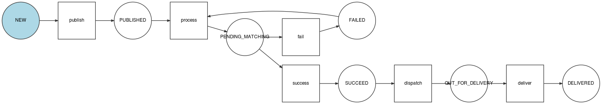

.. _feedbacks:

Demandes
========

Une demande est toujours faite en une zone de responsabilité donnée.
Cette zone de responsabilité peut être renseignée directement ou peut être déterminée grâce à une position géographique.
Si les 2 sont spécifiés alors la position géographique permettra de préciser le lieu (par exemple : au sein d'une grande zone de responsabilité).

Les paramètres optionnels étant la description, la catégorie, une ou plusieurs photos et des métadonnées.

Tous les utilisateurs peuvent créer des demandes.

.. _feedbacks-creation:

Création d'une demande
----------------------

.. code-block:: bash

    POST /feedbacks/issues

Exemple du minimum requis pour effectuer une demande, une demande est créée sans catégorie et sans description. L'utilisateur émettant cette demande est détecté automatiquement grâce à l'authentification.

.. code-block:: json

    {
        "businessActivity": "4bff7cb9-0fd2-4b44-9b0e-f6d17bb4ef36",
        "geo": {
            "elevation": 1,
            "point": {
                "latitude": 44.851343361295214,
                "longitude": -0.5763262510299683
            }
        }
    }

Exemple plus complet, une catégorie et une description sont précisées :

.. code-block:: json

    {
        "businessActivity": "4bff7cb9-0fd2-4b44-9b0e-f6d17bb4ef36",
        "category": "b0d007d5-e6ad-4113-b2b5-d8a1858a2fb1",
        "description": "Mon feedback 5",
        "geo": {
            "elevation":1,
            "point": {
                "latitude":44.851343361295214,
                "longitude":-0.5763262510299683
            }
        },
        "visibility": "VISIBILITY_PUBLIC"
    }

**La visibilité de la demande est par défaut VISIBILITY_PRIVATE si celle-ci n'est pas renseignée.**

L'utilisateur peut ensuite ajouter une ou plusieurs images à sa demande :

.. code-block:: bash

    POST /feedbacks/{feedback}/images

.. code-block:: json

    {
        "image":"data:image/png;base64,iVBORw0KGgoAAAANSUhEUgAAAAUAAAAFCAIAAAACDbGyAAAACXBIWXMAAAsTAAALEwEAmpwYAAAAB3RJTUUH4QIVDRUfvq7u+AAAABl0RVh0Q29tbWVudABDcmVhdGVkIHdpdGggR0lNUFeBDhcAAAAUSURBVAjXY3wrIcGABJgYUAGpfABZiwEnbOeFrwAAAABJRU5ErkJggg=="
    }

Pour plus d'informations sur l'envoi d'images, voir :ref:`technical-files`.

Rattachement d'une demande à une organisation
---------------------------------------------

Le service Keyclic ne se contente pas de recueillir des demandes : elle sont transmises aux organisations concernées, qui en assureront le traitement. Pour cela, trois cas de figure peuvent se présenter :

- Si la position géographique de la demande ne correspond à aucune zone de responsabilité, alors aucune organisation ne recevra cette demande.

- Si la position géographique de la demande se trouve dans une zone de responsabilité définie par une organisation, la demande est automatiquement remonté à l'organisation en question.

- Si la position géographique de la demande se trouve sur deux (ou plus) zones de responsabilité appartenant à deux (ou plus) organisations différentes, mais que l'utilisateur n'a pas précisé de secteur d'activité particulier, alors plusieurs demandes sont générées et remontées à toutes les organisations concernées. La première organisation qui acceptera la demande pourra en effectuer le traitement.

.. _feedbacks-organization-member:

Demande postée par un collaborateur
-----------------------------------

Les :ref:`members-collaborator` peuvent poster des demandes de la même façon que tous les utilisateurs. Cependant si la demande est réalisée par un collaborateur celle-ci pourra être traitée différemment :

- Si sa demande est positionnée dans une zone de responsabilité régie par son organisation, la demande créée qui en découle est automatiquement acceptée.

- Si sa demande n'est pas positionnée dans une zone de responsabilité régie par son organisation, alors sa demande n'est pas automatiquement acceptée.

.. _feedbacks-lifecycle:

Résumé du cycle de vie d'une demande
------------------------------------

.. _feedbacks-retrieving:

Récupération des demandes
-------------------------

Pour récupérer les demandes :

.. code-block:: bash

    GET /feedbacks

Cette requête retourne uniquement les demandes dont le statut est DELIVERED.

Plusieurs critères permettent de filtrer les demandes.

**Par statut : paramètre state**

Par exemple, pour filtrer les demandes délivrées, un utilisateur effectuera la requête :

.. code-block:: bash

    GET /feedbacks?state=DELIVERED

**Autour d'un point : paramètre geo_near**

Exemple :

.. code-block:: bash

    GET /feedbacks?geo_near[radius]=1000&geo_near[geo_coordinates]=+44.8-0.5

retournera les demandes situées dans un rayon de 1000 mètres autour du point de latitude +44.8 et de longitude 0.5.

**Dans un GeoHash : paramètre geo_hash**

GeoHash est un système de géocodage [...] basé sur une fonction de hachage qui subdivise la surface terrestre selon une grille hiérarchique. (Source : `Wikipedia <https://fr.wikipedia.org/wiki/Geohash>`_)

Pour plus d'informations sur GeoHash, voir :

- `Site officiel de GeoHash <http://geohash.org/>`_
- `GeoHash explorer <http://geohash.gofreerange.com/>`_

Les demandes peuvent être filtrées par GeoHash de la façon suivante :

.. code-block:: bash

    GET /feedbacks?geo_hash[]=ezzx&geo_hash[]=ezzz

retournera les demandes comprises dans les geo hash ezzx et ezzz.

**Sur une période donnée : paramètres before et after**

Exemple :

.. code-block:: bash

    GET /feedbacks?after=2017-01-10T00:00:00+05:00&before=2017-02-22T23:59:59+05:00

retournera les demandes effectuées entre le 10/01/2017 et le 22/02/2017.

Les dates sont écrites au format  : `ISO 8601 <https://www.iso.org/iso-8601-date-and-time-format.html>`_.

**Par organisation**

.. code-block:: bash

    GET /feedbacks?organization={organization}

.. _feedbacks-comments:

Commentaires
------------

Les utilisateurs de la communauté peuvent commenter une demande :

.. code-block:: bash

    POST /feedbacks/{feedback}/comments

.. code-block:: json

    {
        "text":"Mon commentaire"
    }

Pour récupérer les commentaires d'une demande :

.. code-block:: bash

    GET /feedbacks/{feedback}/comments

.. _feedbacks-contributions:

Soutiens
--------

Un utilisateur peut soutenir une contribution en effectuant la requête suivante, sans paramètres :

.. code-block:: bash

    POST /feedbacks/{feedback}/contributions

Pour récupérer tous les soutiens effectués sur une demande :

.. code-block:: bash

    GET /feedbacks/{feedback}/contributions
