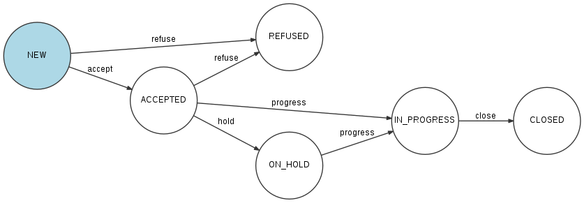
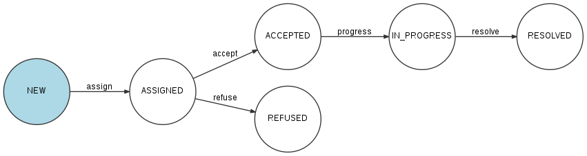

# Rapports

Chaque fois qu'une observation est acceptée, soit après validation par un administrateur du domaine applicatif, soit automatiquement parce que l'utilisateur qui l'a créée était membre de l'organisation concernée par cette observation, un rapport est créé.

Un administrateur d'organisation récupère les rapports concernant son organisation avec :

```
GET /organizations/{organization}/reports
```

Et un rapport donné est récupéré avec :

```
GET /reports/{report}
```

## Cycle de vie d'un rapport

Quand un nouveau rapport est généré à partir d'une observation, il possède le statut NEW.

Le schémas ci-dessous montre l'évolution du statut d'un rapport en fonction des actions qui sont effectuées sur ce rapport.



Un endpoint unique permet de changer le statut du rapport :

```
PATCH /reports/{report}/state
```

Par exemple, pour passer du statut NEW au statut ACCEPTED, l'administrateur de l'organisation effectuera un "accept" en passant dans le corps de la requête :

```json
[
	{
		"op":"replace",
		"path":"/transition",
		"value":"accept"
	}
]
```

Un rapport ne peut être clôturé (statut CLOSED) que si :

- Toutes les opérations associées à ce rapport ont été clôturées ou refusées (voir ci-dessous le paragraphe [Opérations](#opérations))
- Tous les rapports délégués à d'autres organisations à partir de ce rapport ont été clôturés (voir ci-dessous le paragraphe [Délégation de rapports](#délégation-de-rapports))

## Opérations

Une opération est une action à réaliser associée à un rapport et assignée à un membre de l'organisation.

Pour récupérer l'ensemble des opérations associées à un rapport :

```
GET /reports/{report}/operations
```

**Création et modification d'une opération**

Un administrateur d'organisation crée une opération sur un rapport en effectuant la requête :

```
POST /operations
```

Exemple :
```json
{
    "description":"Description de l'opération",
    "name":"Nom de l'opération",
    "report":"cb7118b5-a821-4cf2-9475-0c0d0efdb8d0"
}
```

Une opération nouvellement créée possède le statut NEW.

Une ou plusieurs images peuvent être ajoutées à l'opération :

```
POST /operations/{operation}/images
```

Exemple :
```json
{
    "image":"data:image/png;base64,iVBORw0KGgoAAAANSUhEUgAAAAUAAAAFCAIAAAACDbGyAAAACXBIWXMAAAsTAAALEwEAmpwYAAAAB3RJTUUH4QIVDRUfvq7u+AAAABl0RVh0Q29tbWVudABDcmVhdGVkIHdpdGggR0lNUFeBDhcAAAAUSURBVAjXY3wrIcGABJgYUAGpfABZiwEnbOeFrwAAAABJRU5ErkJggg=="
}
```

La description d'une opération peut être modifiée avec la requête :

```
PATCH /operations/{operation}
``` 

body :
```json
[
	{
		"op":"replace",
		"path":"/description",
		"value":"Nouvelle description"
	}
]
``` 

**Assignation**

Pour assigner une opération à un membre de l'organisation, l'administrateur de l'organisation effectue la requête :

```
LINK /operations/{operation}
```

en passant dans les headers de la requête :
```
Link : /people/{user}
```

où {user} est l'identifiant de l'utilisateur à qui est assigné l'opération.

**Acceptation ou refus**

Une fois assignée, l'opération peut être acceptée ou refusée, soit par la personne à qui l'opération a été assignée, soit par un administrateur de l'organisation. Pour accepter l'opération :

```
PATCH /operations/{operation}/state
```

```json
[
	{
		"op":"replace",
		"path":"/transition",
		"value":"accept"
	}
]
```

**Opération en cours et clôture**

Une fois acceptée, l'opération peut-être passée "en cours" puis "cloturée", soit par la personne à qui l'opération a été assignée, soit par un administrateur de l'organisation.

**Résumé du cycle de vie d'une opération**



**Logs d'une opération**

Un administrateur d'organisation peut consulter l'historique d'une opération avec :

```
GET /operations/{operation}/logs
```

## Délégation de rapports

Un administrateur d'une organisation peut déléguer un rapport à l'une des organisations partenaires.

LIEN : organisations partenaires

Pour déléguer un rapport, un administrateur de l'organisation effectue la requête :

```
POST /organizations/{organization}/delegates
```

où {organization} est l'identifiant de l'organisation **courante** (dont l'utilisateur est administrateur).

Exemple :
```json
{
	"report":"cb7118b5-a821-4cf2-9475-0c0d0efdb8d0",
	"organization":"a31d9ab7-9476-45f2-8cc7-033bf40bbcfa"
}
```

où a31d9ab7-9476-45f2-8cc7-033bf40bbcfa est l'identifiant de l'organisation à laquelle le rapport est délégué.

Déléguer un rapport ne signifie pas que ce rapport est simplement transmis. En effet, le rapport initial n'est pas modifié ni transféré, mais un nouveau rapport "enfant" est créé et attribué à l'organisation partenaire. Ce rapport enfant sera traité par l'organisation partenaire de la même façon que le rapport initial : changements de statuts, opérations, assignations des opérations, etc, jusqu'à sa clôture.

L'organisation partenaire peut elle-même déléguer le rapport à l'une de ses partenaires et ainsi de suite. Pour qu'un rapport puisse être clôturé, il est obligatoire que le rapport enfant, s'il existe, ait été préalablement clôturé par l'organisation partenaire.

## Export des rapports

Un administrateur d'organisation peut exporter tous les rapports de son organisation au format Excel :

```
POST /organizations/{organization}/reports/exports
```

Une archive contenant le fichier Excel listant tous les rapports et les images associées à ces rapports est alors envoyé par email à l'administrateur.


